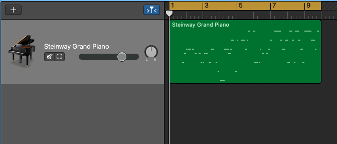

# Music Transformer 

Paper Reference: Music Transformer: Generating music with long-term structure

### Why Transformer is a suitable model for extended length music generation? 

- **RNN**:Learn to proactively store elemnts to be referenced in a fixed size state or memory

- **Self-Attention Transformer**: autoregressive model to access any part of the previously generated output at every step of generation
- Idiomatic piano gestures such as scales, aipeggios, and other motifs all exhibit a certain grammar and recur periodically. Thus capturing relative positional distances makes it easier to model this regularity

### What is the the chanllenge of transferring NLP Transformer model to music generation

- To capture timing and pitch collaboratively, the pairwise distance distance between dimensions need to be cached
- The naive $O(L^2D)$ memory requirement is not practical for 1028 dimension music representation
- The Paper effectively reduced the requirement to $O(LD)$ to enable efficient learning and seq2seq-based generation

### Data Representation

- Represent polyphonic musical into a sequence of discrete tokens

### Transformer Model Formulation

> $L$ : length of the sequence (for example, the number of characters/words in a sentence)
>
> $D$ : The dimension to represent features at each step of the sequence
>
> $X$ : $D\times L$ matrix that represent the data
>
> $W^Q$, $W^K$, and $W^V$ are $D \times D$ square matrices for the weight to generate $L \times D$ query, key and value matrix

$$
Q = XW^{Q}\\
K = XW^{K}\\
V = XW^{V}\\
$$

$Q$, $K$, and $V$ are then split into $H$ $L \times D_{h}$ attention heads, indexed by $h$, and with dimension $D_h = \frac{D}{H}$, which allows model to focus on different parts/dimensions of the data.

A scaled dot-productattemtion computes a sequence of vector outputs for each attention head as 
$$
Z^h = Attention(Q^h,K^h, V^h) = Softmax(\frac{Q^h(K^{h})^T}{\sqrt{D_h}})V^h
$$

 $Z^h$ are then concatenated to Z a $L \times D$ matrix. A causal mask is applied during the query step. Namely an upper triangular mask ensure queries not to get to keys later in the sequence. The feedforward sub-layer then takes the output $Z$ from attention sub-layer, and learned $W_1$, $W_2$, $b_1$ and $b_2$ with 
$$
FF(Z) = ReLU(ZW_1 + b_1)W_2 + b_2
$$

### Variation: Relative positional self-attention

The original transformer architecture relies solely on positional sinusoids to represent timing information. Shaw et al.(2018) introduces relative position representations to inform how far 2 positions are apart in a sequence

With reduced memory requirement by "skewing process", training on long sequences is pragmatic.

### Training 

A Sequence to Sequence setup was applied. The melody was provided and the model is asked to predict the full harmonic elements. 

### Funtime: Playing around with the model

> I found colab notebooks to generate music on magenta project repo : https://magenta.github.io/listen-to-transformer/#a1_66734.mid
>
> Below I will attempt to evalute the model performance based on some trail samples

### Melody Generation:

A motif of music is required to generate the both new music and piano accompaniment for music-transfomer model. I therefore generate single-line melody in GarageBand and converted the loop.aif file into .midi file use the script by https://larkob.github.io/GB2MIDI/index.html.

1. #### Generate music pitch and timing in Garageband

   > I typed in the melody lines for GFriend - Rough, GFriend - Me Gustas Tu, and Eason Chen

   

2. #### Convert stored .aid GarageBand loop file into midi file using the perl script from  https://larkob.github.io/GB2MIDI/index.html.

   

3. #### Use the generate midi to run through the collab notebook provided by the google magenta team

   

### Result 

> Below I generated the accompaniment and extended melody for three times, and select the best version of my musical taste
>
> Let's have a look at how good transformer model performed each task:

#### Original Midi Audio Melody Line

- GFRIEND - Rough

  - <audio src="/Users/changhua/Desktop/music-transformer/rough/rough_aligned.mp3"></audio>

- GFRIEND - Me Gustas Tu

  - <audio src="/Users/changhua/Desktop/music-transformer/gustas/gus.mp3"></audio>

- Eason Chen

  - 
    <audio src="/Users/changhua/Desktop/music-transformer/eason/eason.mp3"></audio>

#### The Midi Audio for continuition 

- GFRIEND - Rough

  - <audio src="/Users/changhua/Desktop/music-transformer/rough/continuation.mp3"></audio>

- GFRIEND - Me Gustas Tu

  - <audio src="/Users/changhua/Desktop/music-transformer/gustas/continuation.mp3"></audio>

- Eason Chen

  - <audio src="/Users/changhua/Desktop/music-transformer/eason/continuation.mp3"></audio>

#### The Midi Audio for accompaniment

- GFRIEND - Rough

  - <audio src="/Users/changhua/Desktop/music-transformer/rough/accompaniment.mp3"></audio>

- GFRIEND - Me Gustas Tu

  - <audio src="/Users/changhua/Desktop/music-transformer/gustas/accompaniment.mp3"></audio>

- Eason Chen

  - <audio src="/Users/changhua/Desktop/music-transformer/eason/accompaniment.mp3"></audio>

### Brief Analysis of the produced result

##### Piano Continuition:

> We selected three pop songs here, and there are lots of repetitive patterns here. The music transformer model was primarily trained on piano pieces, and the melody line may be more diverse and less repetitive. As a result, the generated continuition also contains a lot of repetitive pattern and not so pleasantly formulated. To me, the music transformer model does not acheive acceptable level of production.

##### Piano Accompaniment:

> For music accompaniment, the model could successfully identify the tempo, measure and produced similar chord progression as the original song. The accompaniment is surprisingly good and is beyond my expectation :)

